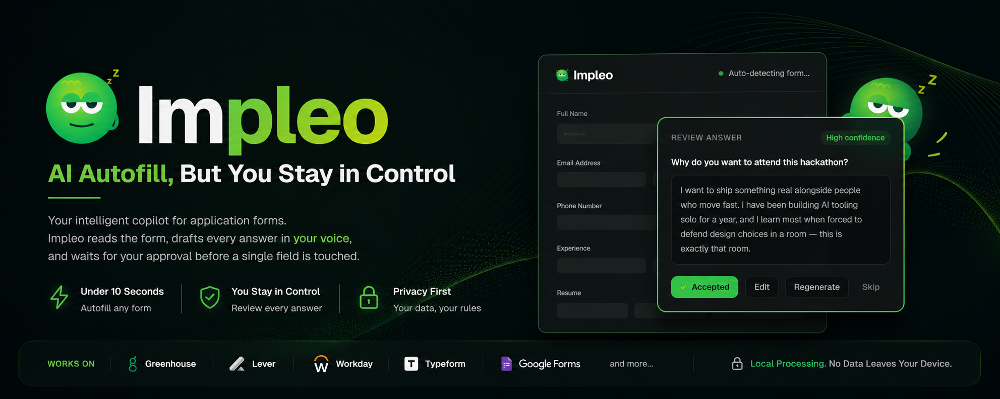
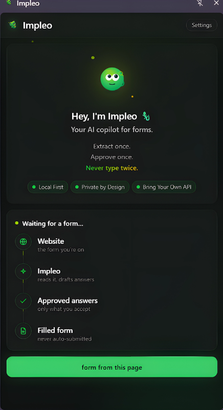
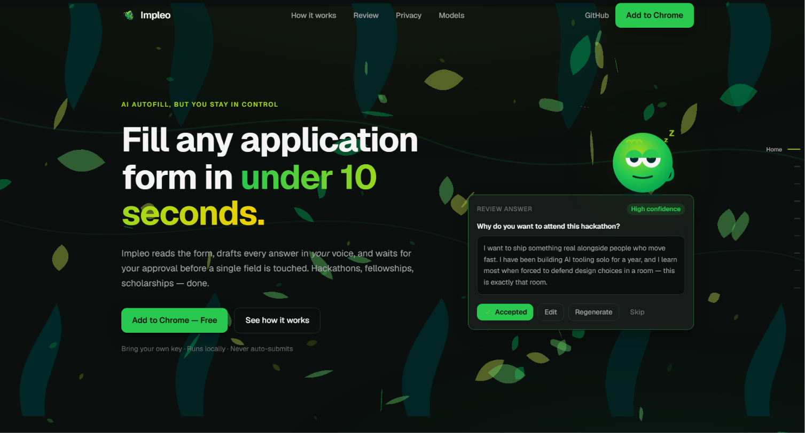
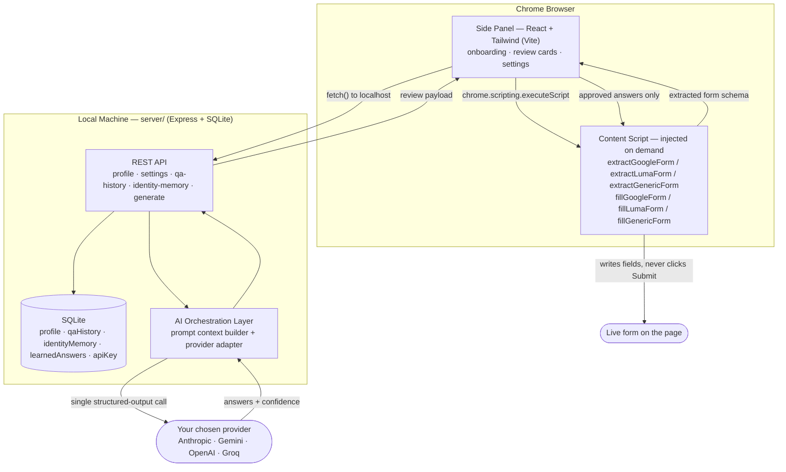
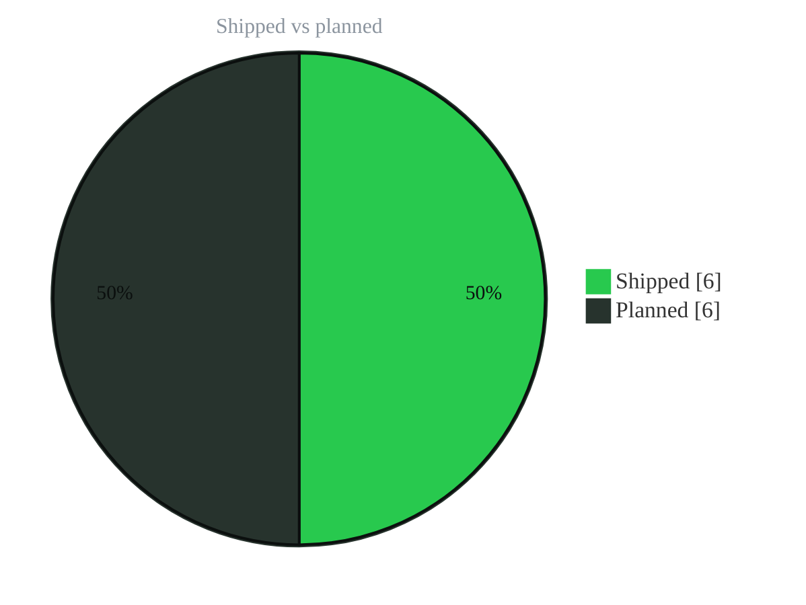
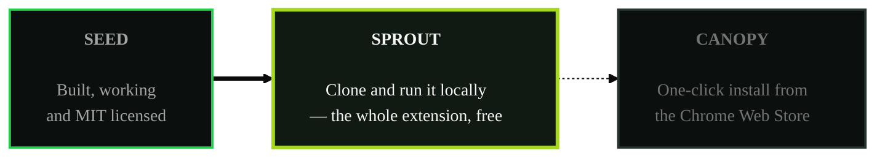

<div align="center">



<br />

### AI Autofill, But You Stay in Control.

**Impleo reads your application forms, drafts every answer in your voice, and waits for your approval before a single field is touched.**

[](https://github.com/Agnik47/Impleo)
[](extension/manifest.json)
[](LICENSE)
[](https://github.com/Agnik47/Impleo/stargazers)
[](extension/manifest.json)
[](#-configuration)

<br />

**[Install from Source](#-installation)** · **[Installation Guide](INSTALLATION.md)** · **[How It Works](#-the-solution)** · **[Architecture](#-architecture)** · **[Privacy](#-privacy)** · **[Roadmap](#-roadmap)**

</div>

<br />

## The Problem

Every hackathon, fellowship, scholarship, accelerator, and job application asks the same mechanical fields — name, email, phone — followed by the questions that actually take time: *"Why do you want to join?"*, *"Tell us about a project you're proud of."*, *"Describe your background."*

Answering those well means pulling context from your resume, your GitHub, your past applications, and whatever you can remember about your own story — then writing it out, by hand, again. Multiply that by every program you apply to, and it's hours of repetitive, low-leverage typing that has nothing to do with whether you're qualified.

Existing tools don't solve this:

- **Traditional autofill** (Chrome's built-in, LastPass, Dashlane) only knows static key-value pairs — name, address, card number. It has no idea how to answer *"what's a technical challenge you overcame?"*
- **Generic AI assistants** (ChatGPT, Gemini web) can draft an answer, but you're still copy-pasting between tabs, re-explaining your background every session, and manually matching answers back to form fields.
- **Resume parsers and "smart" form bots** either fabricate plausible-sounding nonsense the model made up, or — worse — submit forms on your behalf without you ever reading what was sent.

AI-generated answers should never be blindly submitted. A wrong fact, an off-tone sentence, or a hallucinated detail in a scholarship essay isn't a bug you can quietly ship a fix for — it's already been read by a human on the other side.

<br />

## The Solution

Impleo is a **human-in-the-loop** AI copilot for application forms. It never types a form field it hasn't earned the right to guess, and it never submits anything on its own.

<div align="center">

```
  1. Open the application  →  2. Impleo detects fields  →  3. AI drafts responses
                                                                       │
  6. Impleo fills fields   ←  5. You approve or edit     ←  4. You review every answer
```

</div>

| Step | What happens |
|---|---|
| **1. Detect** | Click the extension icon on any application page. Impleo scans the live DOM — Google Forms, Luma, Greenhouse, Lever, Workday, Typeform, or a generic HTML form — and extracts every question, its field type, and its options. |
| **2. Draft** | Your stored profile (resume, projects, writing samples, past answers) plus the extracted schema go to the AI model of your choice in a single call. It returns a structured, per-question answer — not a wall of text to cut apart yourself. |
| **3. Review** | Every answer renders as a card: the question, the generated response, and a confidence badge. Nothing touches the page yet. |
| **4. Approve / Edit / Regenerate / Skip** | You decide, field by field. Regenerate with a one-line instruction ("make it shorter," "more technical") if the first draft isn't right. |
| **5. Fill** | Only what you approved gets written into the live form, with a per-field result so you can catch anything that didn't match. |
| **6. Never submit** | The submit button is never touched, clicked, or focused programmatically. That action stays yours, always. |

> **Human-in-the-loop, by construction — not by policy.** There is no code path in Impleo that can submit a form. Review isn't a setting you can turn off.

<br />

## Product Demo

<table>
<tr>
<td width="50%" valign="top">

**The side panel, waiting for a form**



Local-first, private-by-design, and bring-your-own-key — stated up front, not buried in settings.

</td>
<td width="50%" valign="top">

**Review, edit, or regenerate any answer**


Every card shows a confidence badge and a live regenerate box — steer the tone without leaving the panel.

</td>
</tr>
</table>

<div align="center">

</div>

<br />

## Features

<table>
<tr>
<td width="33%" valign="top">

### 🧠 AI-Native
- Contextual, on-voice answer generation
- Confidence scoring per answer (high / medium / low)
- Regenerate with a natural-language instruction
- Single combined classify + generate call — no wasted latency

</td>
<td width="33%" valign="top">

### 🔒 Human-in-the-Loop
- Accept / Edit / Regenerate / Skip on every field
- Nothing is written until you click Fill
- Per-field fill report (filled / no match / not found)
- Submit button is never touched — structurally, not by convention

</td>
<td width="33%" valign="top">

### 🕶️ Privacy-First
- Bring your own API key (BYOK)
- All processing runs on your machine
- No hosted backend, no analytics, no tracking
- Profile export/import for full data portability

</td>
</tr>
<tr>
<td width="33%" valign="top">

### 🧬 Memory That Compounds
- **Identity memory** — remembers canonical answers (email, CTC, notice period) across every form
- **Learned answers** — previously accepted answers are reused instead of regenerated
- Q&A history (last 50) feeds future few-shot context

</td>
<td width="33%" valign="top">

### 🌍 Works Everywhere
- Google Forms, Luma, Greenhouse, Lever, Workday, Typeform
- Generic HTML form fallback
- Hackathons, fellowships, scholarships, internships, accelerators, grants, job applications, event registrations

</td>
<td width="33%" valign="top">

### 🔌 Multi-Provider
- Anthropic (Claude), Google Gemini, OpenAI, and Groq
- Swap providers and models per your own account/tier
- Key tested against a live call before it's saved

</td>
</tr>
</table>

<br />

## Why Impleo Is Different

| Capability | Traditional Autofill | Generic AI Assistant | Resume Parsers / Form Bots | **Impleo** |
|---|:---:|:---:|:---:|:---:|
| Understands question context | ❌ | ✅ | ⚠️ Partial | ✅ |
| Requires your approval before writing | ➖ N/A | ➖ N/A | ❌ | ✅ |
| Writes in *your* voice | ❌ | ⚠️ Generic | ❌ | ✅ |
| Works across arbitrary form platforms | ⚠️ Known sites only | ❌ Manual copy-paste | ⚠️ Limited | ✅ |
| Privacy-first / local processing | ✅ | ❌ Cloud-only | ❌ Cloud-only | ✅ |
| Runs on your own API key | ➖ N/A | ❌ | ❌ | ✅ |
| **Never auto-submits** | ➖ N/A | ➖ N/A | ❌ Often does | ✅ Always |

<br />

## Architecture

Impleo is deliberately two local pieces talking to each other — no hosted backend, no multi-tenant server, one instance per person.



**Layers, and why each exists:**

- **Content scripts** are self-contained, serialized functions injected only on the active tab, only on demand — no persistent background scanning, no broad `content_scripts` manifest entry.
- **The side panel** never sees your API key. It only talks to your own local server over `fetch()`.
- **`server/` is the only thing** allowed to hold your API key or call an external model provider — the extension itself never sees or transmits it anywhere else.
- **The review pipeline and human approval gate** sit structurally between generation and fill: the fill function only ever receives the subset of answers you explicitly approved.
- **Identity memory + learned answers** persist in SQLite so recurring fields (email, CTC, notice period, "why this role") get smarter, not just faster, over time.

<br />

## Privacy

> **Your data. Your model. Your rules.**

Impleo is built local-first because application answers are personal — resumes, salary expectations, government IDs, life story. That data should never leave a machine you don't control.

- ✅ **Local processing** — the server that talks to your AI provider runs on `localhost`, not in the cloud.
- ✅ **User-owned API keys** — you supply your own key for the provider you trust; Impleo never ships a shared key or proxies your calls through anyone's infrastructure.
- ✅ **No server storage** — there is no Impleo-hosted backend. Your profile, history, and identity memory live in a SQLite file on your disk.
- ✅ **No tracking, no analytics, no telemetry.**
- ✅ **No data selling.** There is no business model that depends on your data — Impleo doesn't have a server to sell it from.
- ✅ **No hidden uploads.** The only network call Impleo ever makes on your behalf is the one you configured, to the provider you chose, when you click Extract.

<br />

## Installation

### Prerequisites

- [Node.js](https://nodejs.org/) 18+ and npm
- Google Chrome (or any Chromium-based browser: Edge, Brave, Arc)
- An API key from at least one supported provider (Anthropic, Google Gemini, OpenAI, or Groq)

### Quick start

```bash
git clone https://github.com/Agnik47/Impleo.git
cd Impleo

cd server && npm install && cd ..
cd extension && npm install && npm run build && cd ..

cd server && npm start
```

Then load `extension/dist` as an unpacked extension via `chrome://extensions` (enable **Developer mode** → **Load unpacked**), and enter your API key in the side panel's **Settings** — Impleo runs a live test call before saving it, so you know immediately if the key works.

> **Using an AI coding agent?** Hand it **[`INSTALLATION.md`](INSTALLATION.md)** directly — it's written as a step-by-step runbook an agent can execute unattended (clone, install, build, start the server, verify), with the two steps that require a human — loading the unpacked extension and entering your API key — clearly called out. It also covers native build prerequisites, port conflicts, and common setup failures in more detail than the summary above.

<br />

## Configuration

### Supported providers

| Provider | Label | Default model suggestion |
|---|---|---|
| **Anthropic** | `anthropic` | `claude-sonnet-5` |
| **Google Gemini** | `gemini` | `gemini-2.0-flash` |
| **OpenAI** | `openai` | `gpt-4o-mini` |
| **Groq** | `groq` | `llama-3.3-70b-versatile` |

Model IDs are never hardcoded to a fixed release — you can type any model string your account has access to under Settings, and that exact string is sent on every call.

### Local storage behavior

All persistent state lives in `server/data/*.db` (SQLite, gitignored) and is never synced anywhere:

- **Profile** — personal info, links, education, skills, projects, resume text, writing samples
- **Q&A history** — last 50 approved question/answer pairs, used as few-shot context
- **Identity memory** — canonical values (email, phone, CTC, notice period, etc.) reused across every form
- **Learned answers** — previously accepted answers, matched by normalized question text
- **API key** — stored once via onboarding/Settings, read only by `server/`, never sent to the extension

### Optional settings

- **Export / Import profile** — back up or transfer your full profile, Q&A history, identity memory, and learned answers as a single JSON file. Exported files contain sensitive values in plain text — handle them like a resume, or more carefully.

<br />

## Repository Structure

```
impleo/
├── extension/                   Chrome MV3 extension (Vite + React + Tailwind)
│   ├── manifest.json             Permissions, entry points, icons
│   ├── background.js             Minimal service worker (side panel behavior only)
│   ├── content-scripts/          Self-contained extractors/fillers per platform
│   │   ├── google-forms.js
│   │   ├── luma.js
│   │   ├── generic-extractor.js
│   │   └── generic-filler.js
│   └── src/sidepanel/            React side panel — onboarding, review flow, settings
│       ├── App.jsx                View routing
│       ├── ReviewFlow.jsx         Extract → review → fill state machine
│       └── components/            Review cards, buttons, UI primitives
│
├── server/                      Local Express + SQLite backend
│   └── src/
│       ├── index.js               Express app entry
│       ├── db.js                  SQLite connection + schema (sole DB access point)
│       ├── providers.js           Anthropic / Gemini / OpenAI / Groq adapters
│       ├── promptContext.js       Builds the profile + schema + history prompt
│       ├── fieldRegistry.js       Canonical identity-memory field definitions
│       └── routes/                profile · settings · qa-history · identity-memory ·
│                                   learned-answers · import-export · generate · test-key
│
├── landing/                     Marketing site (Vite + React)
│
├── IMages/                      Product screenshots and brand assets
│
├── docs/                        Product spec, architecture rationale, brand guide
│
└── INSTALLATION.md              Step-by-step setup runbook (human- and AI-agent-friendly)
```

<br />

## Roadmap

<div align="center">



</div>

- [x] Human-in-the-loop review flow (Accept / Edit / Regenerate / Skip)
- [x] Google Forms, Luma, and generic HTML extraction + fill
- [x] Multi-provider support (Anthropic, Gemini, OpenAI, Groq)
- [x] Identity memory — canonical values reused across forms
- [x] Learned answers — previously accepted answers matched by question
- [x] Profile export / import for backup and portability
- [ ] Greenhouse, Lever, Workday, and Typeform native extractors
- [ ] Resume upload with automatic parsing (currently: paste resume text)
- [ ] Team profiles and shared memories
- [ ] Multi-model routing (auto-select provider per question type)
- [ ] Analytics dashboard (local-only, applications tracked over time)
- [ ] Mobile / cross-browser support

<br />

## Contributing

Impleo started as a personal tool and is built to stay small, boring, and correct rather than sprawling. Contributions are welcome, with a few ground rules:

1. **Read `docs/` before proposing architectural changes.** `docs/PRD.md`, `docs/ARCHITECTURE.md`, and `docs/STRUCTURE.md` capture *why* the system looks the way it does — several design choices (no hosted backend, self-contained content scripts, single combined AI call) are deliberate trade-offs, not oversights.
2. **Human-in-the-loop is non-negotiable.** Any change that lets Impleo write to a form field without an explicit user approval, or touches a submit control, will not be merged.
3. **Privacy is a hard constraint.** No new telemetry, no hosted storage, no calling any endpoint the user didn't configure themselves.
4. **Keep PRs scoped.** Small, reviewable diffs with a clear rationale beat large speculative ones.
5. **Verify against a real page.** Content-script changes should be checked against an actual Google Form / Luma event / target platform, not just read through — DOM structures on these sites are not stable across selectors.

To get started: fork the repo, follow [Installation](#-installation), and open a PR against `main` with a description of what you changed and why.

<br />

## License

Impleo is released under the [MIT License](LICENSE).

```
MIT License — Copyright (c) 2026 Agnik Paul
Permission is hereby granted, free of charge, to any person obtaining a copy
of this software and associated documentation files, to deal in the Software
without restriction, subject to the inclusion of the above copyright notice.
```

See the [LICENSE](LICENSE) file for the full text.

<br />

---

## Where Impleo is growing

Impleo isn't on the Chrome Web Store yet — but it's finished, open source, and free **today**. It just arrives by clone instead of by one click.

<div align="center">



**You are here → Sprout.** The dashed edge is the part that isn't built yet.

</div>

<br />

## Grow the jungle

A jungle grows faster with more hands in it. Cheapest effort first — you don't need to open a pull request to help:

| | Way in | What it does |
|:---:|---|---|
| **✦** | **[Drop a seed](https://github.com/Agnik47/Impleo)** | Star the repo. One click, and it puts Impleo in front of the next person hand-copying their résumé at 2am. |
| **✳** | **[Flag a broken vine](https://github.com/Agnik47/Impleo/issues)** | Form platforms rewrite their DOM without warning. If an extractor stops biting on a page, open an issue with the URL — that report *is* the fix. |
| **⑂** | **[Grow a new branch](https://github.com/Agnik47/Impleo/fork)** | Greenhouse, Lever, Workday and Typeform extractors are all still unclaimed above. Pick one and it's yours. |
| **☰** | **[Clear the path](INSTALLATION.md)** | Setup notes, a sharper error message, a docs fix — anything that saves the next person the hour you just spent. |

> **Three rules of the jungle.** Everything else is up for discussion, but these three aren't:
> **1.** Never auto-submit — there's no code path that clicks submit, and there never will be.
> **2.** Privacy is a hard constraint — no telemetry, no hosted storage, no endpoint the user didn't choose.
> **3.** Keep it scoped — a small, reviewable diff with a clear rationale beats a large speculative one.

<br />

<div align="center">


<br />

**[Install from Source](#-installation)** · **[Installation Guide](INSTALLATION.md)** · **[Architecture](#-architecture)** · **[Privacy](#-privacy)** · **[Contribute](#grow-the-jungle)**

<br />

<sub>Made for anyone tired of typing the same answer twice.</sub>

<br />

<sub>MIT licensed · Local-first, single-user · No tracking, no telemetry, no data selling</sub>

</div>
